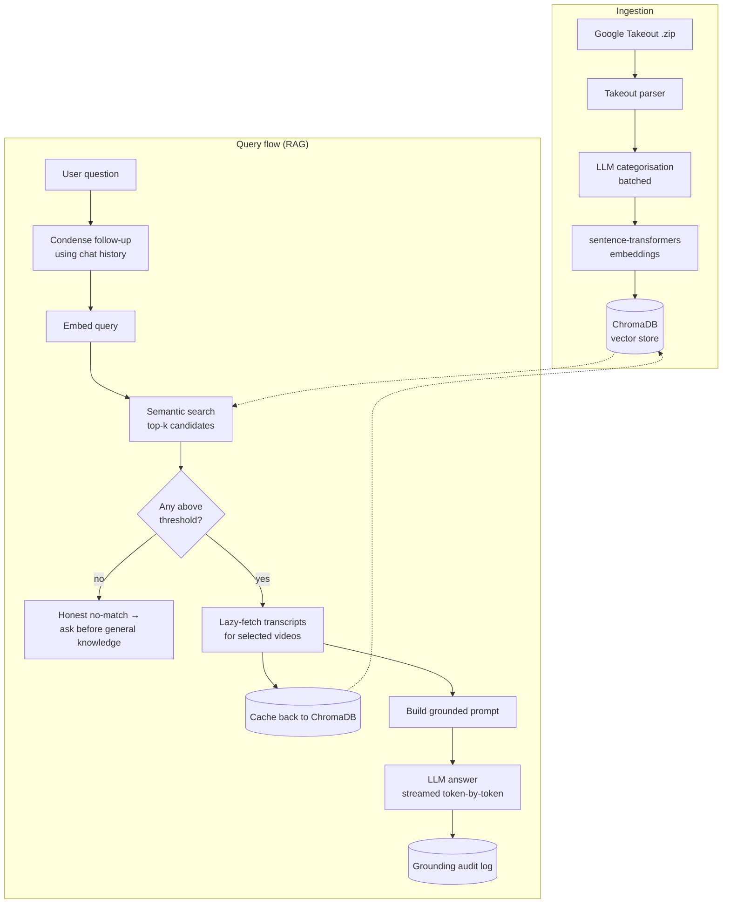

# My YouTube Guru

**Ask questions about everything you've ever watched on YouTube  and get answers grounded in the actual video transcripts, never hallucinated.**

My YouTube Guru is a full **Retrieval-Augmented Generation (RAG)** application built end to end: it ingests your Google Takeout YouTube history, categorises every video with an LLM, embeds them into a vector database, and answers your questions using semantic search over your watch history with **lazy transcript retrieval** and **strict grounding**. When nothing relevant is found, it says so and asks permission before answering from general knowledge  controlling hallucination is the core design goal, and every answer is logged to an audit trail so you can verify it.

Built as an AI Engineer portfolio project to demonstrate the full modern LLM-application stack: RAG, embeddings, vector search, prompt engineering, LLM integration, evaluation, and a production-minded FastAPI backend.

---

## Table of contents

- [What it does](#what-it-does)
- [Key features](#key-features)
- [Architecture](#architecture)
- [Tech stack](#tech-stack)
- [How the RAG pipeline works](#how-the-rag-pipeline-works)
- [Controlling hallucination (grounding)](#controlling-hallucination-grounding)
- [Project structure](#project-structure)
- [Getting started](#getting-started)
- [Configuration](#configuration)
- [Engineering highlights](#engineering-highlights)
- [Limitations & future work](#limitations--future-work)

---

## What it does

1. **Import** your YouTube history from a Google Takeout `.zip` (parsed directly from the real Takeout format).
2. **Categorise** every video with an LLM and **embed** it into a persistent vector database.
3. **Ask** natural-language questions. The app semantically retrieves the most relevant videos, **fetches their transcripts on demand** (caching them so it's a one-time cost), and answers **strictly from those transcripts**, citing its sources.
4. **Verify** grounding on a dedicated evaluation page  every answer's mode, sources, and retrieval confidence are logged.

Everything runs locally from a single command and is driven from a clean browser UI.

> **Screenshots**
> -  a grounded answer with cited video sources
> - the category visualisation
> - the evaluation / audit page

---

## Key features

- **Conversational RAG**  follow-up questions work. A follow-up is rewritten into a standalone search query using the chat history (query condensation) before retrieval, and recent turns are fed into generation so references like *"the second one"* resolve correctly.
- **Adaptive retrieval**  instead of a fixed number of sources, every video above a relevance threshold is used (up to a configurable cap), so the number of sources scales with how many videos are actually relevant.
- **Lazy transcript loading + caching**  transcripts are fetched only for videos that match a question, then cached back into the vector store (and used to refine that video's category), so each video is fetched at most once.
- **Strict grounding with honest fallback**  answers come only from retrieved transcripts. If nothing is relevant, the app refuses to invent an answer and asks before falling back to the LLM's general knowledge.
- **Token-by-token streaming**  answers stream in as they're written, behind a live "thinking" trace that shows the real pipeline steps (searching → retrieving → fetching transcripts → generating).
- **Grounding evaluation & audit log**  an append-only log records every answer's sources and grounding mode, surfaced as metrics (% grounded vs general-knowledge, average sources, transcript coverage, most-cited videos).
- **Chat sessions**  create, rename, and delete conversations, persisted in SQLite and reloadable with their cited sources intact.
- **Re-upload deduplication**  importing a newer Takeout skips videos already indexed and only adds new ones.
- **Rate-limit resilience**  LLM and transcript calls use exponential backoff with jitter.
- **Provider-agnostic LLM layer**  DeepSeek by default (OpenAI-compatible), swappable to OpenAI or others by changing config; the API key is entered in the UI and never written to disk.

---

## Architecture



The backend is a modular FastAPI application. **Service modules are framework-free** (no FastAPI imports) so the core logic is reusable and testable; **routers are thin HTTP adapters** over those services. The vanilla-JS frontend is served by the same process, so one command runs the whole app.

---

## Tech stack

| Layer | Technology |
|---|---|
| **Backend / API** | Python, FastAPI, Pydantic, Uvicorn |
| **LLM integration** | DeepSeek via OpenAI-compatible API (provider-configurable), streaming |
| **Embeddings** | `sentence-transformers`  `all-MiniLM-L6-v2` (384-dim, cosine) |
| **Vector database** | ChromaDB (persistent, local) |
| **Transcripts** | `youtube-transcript-api` (lazy, cached) |
| **Session storage** | SQLite (stdlib `sqlite3`) |
| **Evaluation** | Append-only JSONL audit log |
| **Frontend** | Vanilla HTML/CSS/JS, Chart.js, self-contained Markdown renderer, Server-Sent Events |

---

## How the RAG pipeline works

The query flow (`app/services/rag_pipeline.py`) is the heart of the project:

1. **Condense (follow-ups only).** If the question is part of an ongoing chat, the LLM rewrites it into a standalone search query using recent turns  so *"tell me more about the manual approach"* becomes something searchable. First questions skip this step.
2. **Embed & retrieve.** The query is embedded with `all-MiniLM-L6-v2` and matched against ChromaDB using cosine similarity, pulling a candidate pool.
3. **Adaptive selection + relevance gate.** Every candidate above the similarity threshold is kept (up to a cap). If none clear the threshold, the pipeline stops  no transcript fetching, no guessing  and returns an honest *"not in your watch history"* response.
4. **Lazy transcript resolution.** For the selected videos only, transcripts are fetched from YouTube (with retry/backoff), **cached back into ChromaDB** with a refreshed embedding and category, and videos with no captions are remembered so they're never re-fetched. This turns retrieval into a one-time cost per video.
5. **Grounded generation.** A carefully engineered system prompt instructs the model to answer **only** from the supplied transcripts, cite sources inline, admit when the answer isn't there, and distinguish inference-from-title vs. transcript content. Recent conversation is included for continuity but explicitly marked as *not* a source of facts. The answer streams token-by-token.
6. **Log.** The answer's mode, sources, and retrieval confidence are appended to the grounding audit log.

---

## Controlling hallucination (grounding)

This is the project's central concern, addressed at four levels:

- **Retrieval gate**  a similarity threshold prevents irrelevant videos from ever reaching the model; below it, the app declines rather than stretching a weak match into a confident answer.
- **Prompt engineering**  the grounding system prompt (a clearly-labelled, auditable constant) forbids outside knowledge, requires inline citations, and mandates admitting gaps.
- **Explicit user consent**  general knowledge is only ever produced through a separate path the user must confirm, and such answers are visibly flagged as *not from your videos*.
- **Evaluation**  the audit log + metrics page make grounding measurable: what fraction of answers stayed grounded, how many sources each used, and how much was backed by real transcripts vs. titles alone.

---

## Project structure

```
my-youtube-guru/
├── app/
│   ├── main.py                 # FastAPI app factory, middleware, static frontend
│   ├── config.py               # typed settings (pydantic-settings), no hardcoded secrets
│   ├── models/
│   │   └── schemas.py          # Pydantic request/response models
│   ├── routers/                # thin HTTP adapters
│   │   ├── upload.py           # Takeout upload + background ingest with progress
│   │   ├── chat.py             # ask / confirm (+ SSE streaming variants)
│   │   ├── knowledge_base.py   # category counts + video browsing
│   │   ├── sessions.py         # chat session CRUD
│   │   ├── evaluation.py       # grounding metrics + audit log
│   │   └── settings.py         # runtime LLM/API-key config
│   ├── services/               # framework-free core logic
│   │   ├── takeout_parser.py   # parse the real Takeout watch-history format
│   │   ├── embeddings.py       # sentence-transformers wrapper (lazy load)
│   │   ├── vector_store.py     # ChromaDB: upsert, search, dedup, caching
│   │   ├── llm_service.py      # the only place the app talks to an LLM
│   │   ├── transcripts.py      # youtube-transcript-api with retry/backoff
│   │   ├── ingestion.py        # categorise → embed → store (with dedup)
│   │   ├── rag_pipeline.py     # the RAG query flow (grounding logic)
│   │   ├── chat_store.py       # SQLite chat session persistence
│   │   └── grounding_log.py    # append-only grounding audit log + metrics
│   └── utils/
│       ├── retry.py            # exponential-backoff helper
│       └── jobs.py             # background job manager for long ingests
├── frontend/                   # vanilla-JS UI served by FastAPI
│   ├── index.html
│   ├── styles.css
│   └── app.js
├── scripts/                    # standalone CLIs for testing each stage
│   ├── preview_takeout.py
│   ├── ingest.py
│   └── ask.py
├── requirements.txt
├── .env.example
└── .gitignore
```

---

## Getting started

### Prerequisites

- **Python 3.11 or 3.12** ([python.org](https://www.python.org/downloads/)  during install, tick *"Add Python to PATH"*)
- A **DeepSeek API key** (or any OpenAI-compatible provider)  [platform.deepseek.com](https://platform.deepseek.com/)

### Install & run (Windows / PowerShell)

```powershell
# from the project folder
python -m venv .venv
.\.venv\Scripts\Activate.ps1
python -m pip install --upgrade pip
pip install -r requirements.txt

# optional: create a local config (the API key can also be set in the UI)
Copy-Item .env.example .env

# run the app (UI + API from one command)
uvicorn app.main:app --reload
```

On macOS/Linux the only difference is activation: `source .venv/bin/activate`.

Then open **http://127.0.0.1:8000/** and:

1. **Settings** → paste your API key.
2. **Add data** → import your Takeout `.zip`.
3. **Ask** → question your history; **Knowledge base** → explore it; **Grounding** → verify it.

Interactive API docs are at **http://127.0.0.1:8000/docs**.

> **Getting your data:** at [takeout.google.com](https://takeout.google.com), export **YouTube and YouTube Music → history**.

### Test each stage from the command line

```powershell
python scripts\preview_takeout.py path\to\takeout.zip          # parser
python scripts\ingest.py path\to\takeout.zip --no-llm --limit 50   # ingest (no key needed)
python scripts\ask.py "what have I learned about vector databases?"  # RAG loop
```

---

## Configuration

All settings have sensible defaults in `app/config.py` and can be overridden via `.env` (see `.env.example`). Nothing is required except an API key (which can be set in the UI instead).

| Variable | Default | Purpose |
|---|---|---|
| `LLM_PROVIDER` / `LLM_BASE_URL` / `LLM_MODEL` | `deepseek` / `https://api.deepseek.com` / `deepseek-chat` | LLM provider (OpenAI-compatible) |
| `LLM_API_KEY` | *(empty)* | API key  optional here; entered in the UI |
| `EMBEDDING_MODEL_NAME` | `all-MiniLM-L6-v2` | sentence-transformers model |
| `CHROMA_PERSIST_DIR` / `CHROMA_COLLECTION` | `./data/chroma` / `youtube_history` | vector store |
| `CHAT_DB_PATH` | `./data/chat.db` | SQLite chat sessions |
| `GROUNDING_LOG_PATH` | `./data/grounding_log.jsonl` | grounding audit log |
| `RETRIEVAL_CANDIDATES` | `15` | candidate pool pulled from the vector store |
| `TOP_K_RESULTS` | `6` | max videos used per answer (adaptive, capped) |
| `SIMILARITY_THRESHOLD` | `0.25` | relevance gate for grounding |
| `TRANSCRIPT_CHAR_BUDGET` | `6000` | max characters of each transcript sent to the LLM |

> **Cost/latency tip:** the model's context per question ≈ `TOP_K_RESULTS × TRANSCRIPT_CHAR_BUDGET`. Keep that product modest to control token cost and speed.

---

## Engineering highlights

Design decisions worth calling out:

- **Framework-free core, thin routers.** All real logic lives in `app/services/*` with no web-framework dependency, making it reusable from scripts and unit-testable; routers just adapt HTTP to those services.
- **Single LLM boundary.** Every model interaction goes through one service, so the provider is swappable in one place and the API key lives only in memory.
- **Streaming over a unified event channel.** The same Server-Sent Events stream carries progress events *and* answer tokens, so adding token-by-token streaming was a matter of emitting more events, not new plumbing.
- **Background ingestion with pollable progress.** Uploading thousands of videos is validated synchronously (fast failure on bad files) then run on a worker thread with a status endpoint the UI polls  no request timeouts.
- **Correctness details that matter:** dedup runs *before* categorisation so re-uploads never re-spend tokens; transcript caching *merges* metadata so it can't corrupt a video's record; streaming retries only before the first token so it can never duplicate output; and the grounding log is best-effort so it can never break answering.
- **Self-contained, dependency-free Markdown rendering** on the frontend (escaped-first, XSS-safe)  no CDN reliance.

---

## Limitations & future work

- **Transcript chunking.** Long transcripts are currently truncated to a character budget. Splitting transcripts into passages, embedding each, and retrieving only the most relevant chunks would improve answer quality on long videos while lowering token cost  the natural next upgrade.
- **Cloud transcript access.** `youtube-transcript-api` is blocked from cloud-provider IPs, so transcript fetching works from a local/residential machine; a proxy is needed for cloud deployment (the app degrades gracefully to title-only answers otherwise).
- **Single-user, local scope.** Session state and the job manager are in-process; a multi-user deployment would move these to a shared store and task queue.
- **Retrieval quality.** The relevance gate is a tunable similarity threshold; an LLM-based reranker could further sharpen which videos are considered relevant.

---

## License

Released under the MIT License  see `LICENSE`.

*This is a personal portfolio project and is not affiliated with YouTube or Google.*
